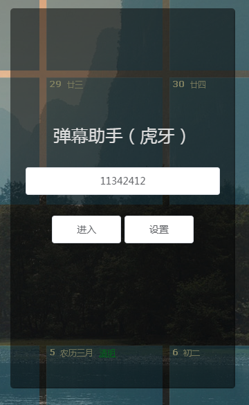
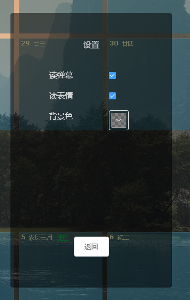

# barrage-helper

> 一个使用electron-vue制作的弹幕助手

目前只有连接虎牙弹幕的功能，目前能够

- 获取房间信息
- 播报弹幕
- 窗口置顶

### 预览


### 开始

``` bash

# 启动
npm run dev

```

---

解决node 14.4下打包报错的问题，[参考](https://www.jianshu.com/p/bdf0a23e7257)

Generated with [electron-vue](https://github.com/SimulatedGREG/electron-vue)
