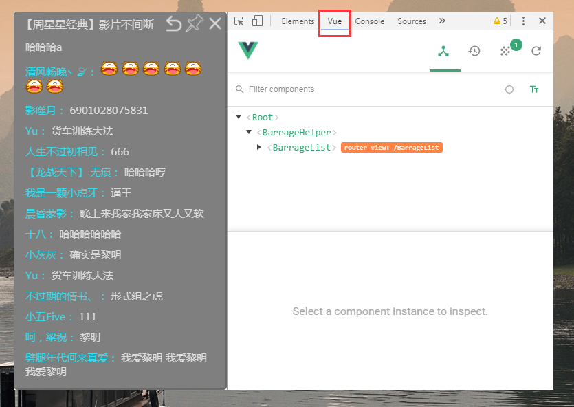
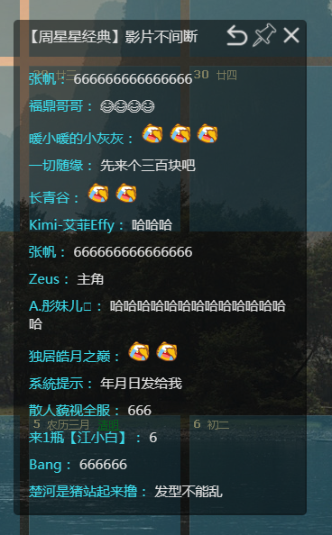

### 为Electron 安装 vue-devtool ###

> 相关代码:
[https://github.com/WozHuang/Barrage-helper/blob/master/src/main/index.dev.js](https://github.com/WozHuang/Barrage-helper/blob/master/src/main/index.dev.js)

在SPA逐渐成为构建优秀交互体验应用的主流方式后，使用Electron开发跨平台的软件是一个优秀的解决方案。下面简单介绍一下 Electron-vue 安装 vue-devtool的方式。

#### 安装步骤 ####

1. 下载 vue-devtools.crx，把文件名后缀改成zip后解压放在工程目录下
> （找不到或者懒得下可以直接克隆我的仓库后把[这个文件夹](https://github.com/WozHuang/Barrage-helper/tree/master/devTools/vue-devtools)给复制出来，我已经解压好放在里面了）

2. Electron-Vue中本来是应该预装好了vue-devtool的，奈何 `electron-devtools-installer` 这个库不知道有什么问题，只能自己手动装了，[部分代码](https://github.com/WozHuang/Barrage-helper/blob/master/src/main/index.dev.js)：

```js
// Install `vue-devtools`
require('electron').app.on('ready', () => {

  // 注释掉的这部分是 Electron-Vue 中预装devtool的代码，没有用
  // let installExtension = require('electron-devtools-installer')
  // installExtension.default(installExtension.VUEJS_DEVTOOLS)
  //   .then(() => {})
  //   .catch(err => {
  //     console.log('Unable to install `vue-devtools`: \n', err)
  //   })

  // 新增的：安装vue-devtools
  BrowserWindow.addDevToolsExtension(path.resolve(__dirname, '../../devTools/vue-devtools'));
  
});
```

除了vue-devtool，安装其他的扩展也是同理，但是估计没有什么用（Electron已经为浏览器放开很多限制不需要扩展了）

#### 效果图 ####



最后，有兴趣可以看下这个用 Electron-vue 做的小玩具：[一个弹幕助手](https://github.com/WozHuang/Barrage-helper)，主要功能有显示并朗读弹幕、背景色及透明度设置和窗口置顶。



#### 参考 ####

[Electron文档中关于DevTool](https://electronjs.org/docs/tutorial/devtools-extension)